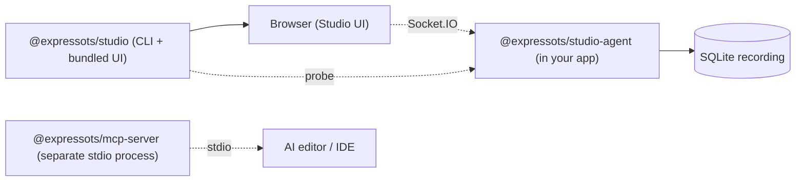

# ExpressoTS Studio

> **Status: PREVIEW (v4.0.0-preview.1).** Studio is published under the npm `preview` dist-tag for the v4.0.0 release line. The polished GA ships with **v4.1.0**. See [Known limitations](#known-limitations-v400-preview).

**Developer Experience Platform for ExpressoTS**

ExpressoTS Studio adds local route discovery, request timeline, and a developer dashboard on top of any v4 ExpressoTS application.

## The Magic Loop

```
Generate → Run → Observe → Fix → Deploy
```

## Packages

| Package                       | Description                                                     |
| ----------------------------- | --------------------------------------------------------------- |
| `@expressots/studio`          | CLI, orchestrator, and bundled web UI (everything dev-side)     |
| `@expressots/studio-agent`    | Instrumentation, tracing, and route discovery (runs in the app) |
| `@expressots/mcp-server`      | AI integration via Model Context Protocol (preview)             |

## Quick start

```bash
# In your ExpressoTS v4 project
npm install -D @expressots/studio@preview

# Launch Studio
npx expressots-studio
# or via the framework CLI
expressots studio
```

The CLI prints a preview banner on every launch.

## Features (working in preview)

- **Route Discovery**: detect controllers, services, providers, middleware (regex-based today; container-introspection in v4.1).
- **Request Timeline**: live view of incoming requests recorded to a local SQLite database.
- **Trace Detail**: OpenTelemetry spans rendered per request.
- **Metrics Dashboard**: P50/P95/P99 latency, error rates, request count.
- **Architecture Map**: read-only XYFlow graph of detected components.
- **Replay**: replays a recorded request against your running app and diffs status/duration/body.
- **API Client**: built-in HTTP client (method/URL/headers/body/query) that fires requests at your app and shows live responses.

## Known limitations (v4.0.0-preview)

These are tracked for v4.1.0 GA in [ROADMAP_v4.1.md](../ROADMAP_v4.1.md):

- **`SocketContext` does not yet handle the `exchange` event** (single-exchange UI updates).
- **Sidebar Settings panel is non-functional.**
- **Studio agent does not yet consume `AppContainer.introspect()`**; the architecture graph is built from a regex source-scan only.
- **MCP server is parallel, not integrated**: the `@expressots/mcp-server` binary works as an MCP code-generation provider but does not yet expose Studio recordings as MCP resources.
- **AI Fix Generator** is on the v4.1.0 roadmap and not present in the preview UI.
- **Cloud Studio**: not in scope for v4.x.

## Architecture (current implementation)



## Requirements

- Node.js >= 20.18.0
- ExpressoTS >= 4.0.0

## Development

```bash
npm install
npm run build
npm run dev          # @expressots/studio in tsc --watch
```

## License

MIT (c) ExpressoTS
