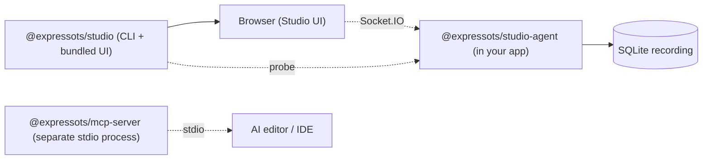

# ExpressoTS Studio

> **Status: PREVIEW (v4.0.0-preview).** Studio is published under the npm `preview` dist-tag for the v4.0.0 release line. The polished GA ships with **v4.1.0**. See [Known limitations](#known-limitations-v400-preview).

**Developer Experience Platform for ExpressoTS**

ExpressoTS Studio adds local route discovery, request recording, log capture, live error and security analysis, and a developer dashboard on top of any v4 ExpressoTS application. Everything runs locally; nothing is sent off the machine.

## The Magic Loop

```
Generate → Run → Observe → Fix → Deploy
```

## Packages

| Package                       | Description                                                                |
| ----------------------------- | -------------------------------------------------------------------------- |
| `@expressots/studio`          | CLI, orchestrator, and bundled web UI (everything dev-side)                |
| `@expressots/studio-agent`    | Instrumentation, tracing, recording, log capture, security (runs in-app)   |
| `@expressots/mcp-server`      | AI integration via Model Context Protocol (preview)                        |

## Quick start

```bash
# In your ExpressoTS v4 project
npm install -D @expressots/studio@preview @expressots/studio-agent@preview

# Launch Studio
npx expressots-studio
# or via the framework CLI
expressots studio
```

Studio auto-activates when `@expressots/studio-agent` is installed and `NODE_ENV` is `development` (or unset). Set `EXPRESSOTS_STUDIO=false` to opt out. The CLI prints a preview banner on every launch.

## Features

| View              | Description                                                                                                  |
| ----------------- | ------------------------------------------------------------------------------------------------------------ |
| Status Dashboard  | App health, runtime info, DI scope counts, top routes, and the aggregate security score.                     |
| Architecture Map  | Read-only graph of controllers, use-cases, providers, and middleware, with DI scope badges and active paths. |
| Request Timeline  | Live recording of every HTTP request to local SQLite, with per-route P50/P95/P99 and error rate.             |
| Trace Detail      | OpenTelemetry spans rendered per request with headers/body diff and a one-click Replay.                      |
| Live Logs         | In-memory buffer of every framework + app log line, filterable by level, route, and context.                 |
| Error Inspector   | Aggregated runtime errors with stack frames, deep-links to source via `openInEditor`.                        |
| Security View     | `npm audit` + OSV.dev supply-chain advisories, root-cause chains, reachability scoring, and one-click fixes; OWASP API Top 10 runtime posture findings derived from recorded traffic. |
| API Client        | Built-in HTTP client (method/URL/headers/body/query) that fires requests at your app and shows live responses. |
| Settings drawer   | Theme, recording cap, replay diff filters, and keyboard shortcuts.                                           |

## Known limitations (v4.0.0-preview)

Tracked for v4.1.0 GA in [ROADMAP_v4.1.md](../ROADMAP_v4.1.md):

- **MCP server is parallel, not integrated**: the `@expressots/mcp-server` binary works as a stdio MCP code-generation provider but does not yet expose Studio recordings as MCP resources.
- **AI Fix Generator** is on the v4.1.0 roadmap and not present in the preview UI.
- **Cloud Studio**: not in scope for v4.x.

## Architecture (current implementation)



## Requirements

- Node.js >= 20.18.0
- ExpressoTS >= 4.0.0

## Development

```bash
npm install
npm run build
npm run dev          # @expressots/studio in tsc --watch
```

## License

MIT (c) ExpressoTS
