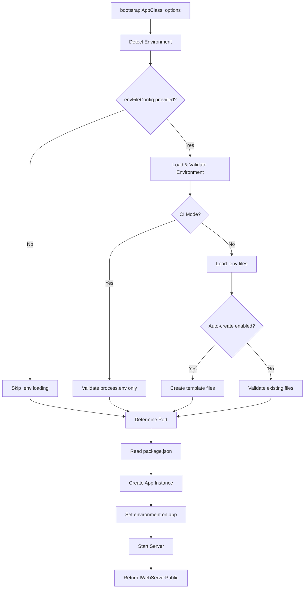
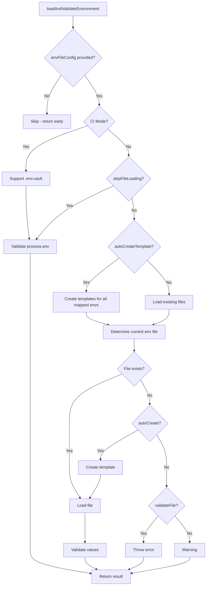

# Application Bootstrap - Architecture

> 🎯 **Audience**: Framework developers and contributors

This document explains the internal architecture, design decisions, and implementation details of the application bootstrap system.

---

## Overview

The bootstrap system orchestrates application startup through 8 critical phases:

1. **Environment Detection** - CI/CD vs local development
2. **Smart .env Loading** - Opt-in file loading with validation
3. **Port Determination** - Priority chain resolution
4. **Package Metadata** - Reading app name/version
5. **DI Container Init** - Creating app instance via AppFactory
6. **Environment Injection** - Setting environment on app instance
7. **API Version Detection** - Scanning decorators (happens in banner)
8. **Server Startup** - Listening with graceful shutdown

---

## Architecture Diagram



---

## Core Components

### 1. `bootstrap()` Function

**Location**: `bootstrap.ts:797`

**Responsibilities**:
- Orchestrate startup sequence
- Handle errors with helpful messages
- Return public server interface

**Key Design**:
- Async/await for clean error handling
- Early validation (fail fast)
- Progressive enhancement (zero config → full config)

### 2. `loadAndValidateEnvironment()`

**Location**: `bootstrap.ts:538`

**Responsibilities**:
- Opt-in .env file loading
- CI/CD detection and handling
- Template file creation
- Variable validation

**Key Design Decisions**:
- **Opt-in by default**: Only loads files if `envFileConfig` provided
- **CI-aware**: Auto-detects CI environment
- **Template creation**: Can create missing files (opt-in)
- **Validation**: Separate file vs value validation

**Flow**:
```
1. Check if envFileConfig provided → Skip if not
2. Detect CI environment
3. If CI → Validate process.env only
4. If local → Load .env files
5. Validate required variables
6. Return result with metadata
```

### 3. `AppFactory.create()`

**Location**: `application-factory.ts:33`

**Responsibilities**:
- Type-safe app instantiation
- DI container initialization
- Error handling for invalid types

**Key Design**:
- Type guard for constructor validation
- Returns builder interface for chaining
- Logger integration for errors

### 4. Port Determination

**Location**: `bootstrap.ts:710`

**Priority Chain**:
1. `options.port` (explicit)
2. `process.env.PORT` (environment)
3. `3000` (fallback)

**Special Case**: `port: 0` → OS-assigned port (Express.js feature)

### 5. Package.json Reading

**Location**: `bootstrap.ts:733`

**Purpose**: Extract app name and version for banner/logs

**Design**:
- Graceful fallback if package.json missing
- Async file reading
- JSON parsing with error handling

---

## Environment Loading Deep Dive

### Decision Tree



### File Loading Order

When loading .env files, the system follows this order:

1. **Optional files** (loaded silently, failures ignored):
   - `.env` (base file)
   - `.env.local` (local overrides)
   - `.env.{environment}.local` (environment-specific local)

2. **Required file** (for current environment):
   - `envFileConfig.files[currentEnvironment]` OR
   - `.env.{currentEnvironment}` (convention)

3. **Special**: `.env.vault` (if `DOTENV_KEY` present in CI)

### Validation Strategy

**File Validation** (`validateFile`):
- Checks if required .env file exists
- Default: `true` locally, `false` in CI
- Throws `EnvFileNotFoundError` with helpful template

**Value Validation** (`validateValues`):
- Checks if variables have non-empty values
- Default: `true` in production/CI, `false` in development
- Throws `EnvValidationError` with missing variables

**Required Variables** (`required`):
- Always validated (even if `validateValues: false`)
- Added to template when auto-creating
- Validated from `process.env` in CI mode

---

## Error Handling

### Custom Error Classes

1. **`EnvFileNotFoundError`**
   - Location: `bootstrap.ts:346`
   - Triggered: When required .env file missing
   - Includes: Template content, docs link, helpful commands

2. **`CIEnvValidationError`**
   - Location: `bootstrap.ts:368`
   - Triggered: Missing variables in CI/CD
   - Includes: Platform-specific setup hints

3. **`EnvValidationError`**
   - Location: `bootstrap.ts:398`
   - Triggered: Empty required variables
   - Includes: Variable names, example values

### Error Message Design

All errors follow this pattern:
- ❌ Clear problem statement
- 💡 Actionable solution
- 📖 Documentation link
- 🔍 Debugging hints

---

## CI/CD Integration

### Auto-Detection

The system detects CI environments by checking:

```typescript
process.env.CI ||
process.env.GITHUB_ACTIONS ||
process.env.GITLAB_CI ||
process.env.JENKINS_URL ||
// ... and more
```

### CI Behavior

When CI detected:
- Skips .env file loading
- Validates `process.env` only
- Never creates template files
- Provides platform-specific hints

### Platform Hints

Each CI platform gets custom setup instructions:

- **GitHub Actions**: Settings → Secrets and variables → Actions
- **GitLab CI**: Settings → CI/CD → Variables
- **Jenkins**: Manage Jenkins → Credentials

---

## Testing Considerations

### Port 0 Pattern

```typescript
const server = await bootstrap(App, { port: 0 });
// server.port contains OS-assigned port
```

**Benefits**:
- Parallel test execution
- No port conflicts
- Dynamic port allocation

### Environment Isolation

For tests:
```typescript
await bootstrap(App, {
  envFileConfig: {
    skipFileLoading: true,  // Use test-specific env vars
    required: []  // Skip validation in tests
  }
});
```

---

## Performance Characteristics

### Startup Time Breakdown

- Environment loading: ~2-5ms (file I/O)
- Package.json read: ~1-2ms
- App instantiation: ~5-10ms (DI container setup)
- Port binding: OS-dependent (~1-10ms)
- **Total**: ~10-30ms typical

### Optimization Opportunities

1. **Lazy package.json reading**: Only read if name/version needed
2. **Parallel file loading**: Load optional files concurrently
3. **Cache environment result**: Avoid re-validation

---

## Extension Points

### Adding New Environment Sources

To add support for new environment sources:

1. Extend `loadAndValidateEnvironment()`
2. Add detection logic
3. Create custom error class if needed
4. Update documentation

### Custom Validation

To add custom validation:

1. Extend `EnvironmentFileConfig` interface
2. Add validation logic in `loadAndValidateEnvironment()`
3. Create validation error class
4. Document in public API

---

## Related Code

- **AppFactory**: `application-factory.ts`
- **AppContainer**: `application-container.ts`
- **Logger**: `../provider/logger/logger.provider.ts`
- **Config Parser**: `@expressots/shared` (parse function)

---

## Future Improvements

1. **Hot Reload**: Support for .env file watching
2. **Schema Validation**: JSON Schema for .env files
3. **Encryption**: Built-in .env.vault support
4. **Metrics**: Startup time tracking
5. **Health Checks**: Built-in readiness/liveness endpoints

---

## AppFactory Architecture

### Overview

`AppFactory` is a simple factory class that creates instances of `IWebServer` implementations. It's used internally by `bootstrap()` but exposed for advanced use cases.

### Responsibilities

1. **Type-safe instantiation** - Validates constructor types
2. **Error handling** - Provides clear error messages for invalid types
3. **Logger integration** - Logs errors before throwing

### Implementation

```typescript
public static async create<T extends IWebServer>(
  webServerType: IWebServerConstructor<T>,
): Promise<IWebServerBuilder>
```

**Flow:**
1. Validate constructor using type guard
2. Instantiate class (triggers constructor)
3. Return builder interface

### Type Guard

`isWebServerConstructor()` ensures runtime type safety:

```typescript
function isWebServerConstructor<T extends IWebServer>(
  input: unknown,
): input is IWebServerConstructor<T>
```

### Design Decisions

- **Static method**: Simple factory pattern, no instance needed
- **Type guard**: Runtime validation for type safety
- **Builder return**: Enables method chaining
- **Async**: Consistent with bootstrap() API

---

## AppContainer Architecture

### Overview

`AppContainer` wraps InversifyJS `Container` with ExpressoTS-specific defaults and utilities.

### Responsibilities

1. **Container creation** - Creates InversifyJS container with defaults
2. **Module loading** - Loads built-in provider module + custom modules
3. **Debugging utilities** - Provides `viewContainerBindings()` for inspection
4. **Configuration access** - Exposes container options

### Default Configuration

```typescript
{
  defaultScope: BindingScopeEnum.Request,  // One per HTTP request
  autoBindInjectable: true                 // Auto-bind @injectable() classes
}
```

### Implementation Flow

```typescript
public create(modules: Array<ContainerModule>): void
```

**Steps:**
1. Merge options with defaults
2. Create InversifyJS container
3. Bind container to itself (for injection)
4. Load `buildProviderModule()` (built-in providers)
5. Load custom modules

### Binding Scopes

**Request Scope (Default):**
- One instance per HTTP request
- Stateless and scalable
- Recommended for most services

**Singleton Scope:**
- One instance for app lifetime
- Shared state across requests
- Use for stateless services or caches

**Transient Scope:**
- New instance every time
- No caching
- Use sparingly (performance impact)

### Debugging Utilities

**`viewContainerBindings()`:**
- Accesses internal binding dictionary
- Formats as console table
- Shows: identifier, scope, type, cache status

**`getContainerOptions()`:**
- Returns current container configuration
- Useful for debugging scope issues

### Design Decisions

- **Request scope default**: Stateless, scalable architecture
- **Auto-bind injectable**: Convenience for developers
- **Wrapper pattern**: Hides InversifyJS complexity
- **Debugging support**: Essential for DI troubleshooting

---

## Component Relationships

```
bootstrap()
  └─> AppFactory.create()
        └─> new AppClass()
              └─> AppContainer (created internally)
                    └─> Container.create()
                          └─> buildProviderModule()
                          └─> Custom modules
```

---

## See Also

- [Bootstrap Public API](./bootstrap-public-api.md) - User-facing documentation
- [AppFactory Public API](./app-factory-public-api.md) - AppFactory documentation
- [AppContainer Public API](./app-container-public-api.md) - AppContainer documentation
- [Decision Log](./decision-log.md) - Design decisions
- [Examples](./examples/) - Code examples

