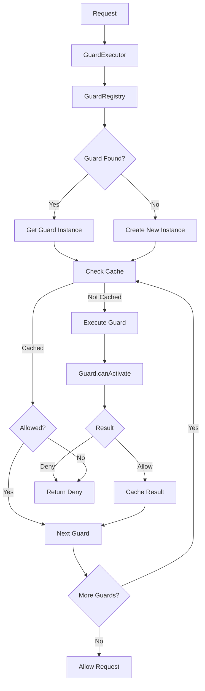

# Authorization System - Architecture

> 🎯 **Audience**: Framework developers and contributors

This document explains the internal architecture, design decisions, and implementation details of the ExpressoTS authorization system.

---

## Overview

The authorization system provides a flexible, extensible guard-based authorization mechanism with:

- **Guard Discovery**: Auto-discovery via `@Guard()` decorator
- **Priority Execution**: Guards execute in priority order
- **Caching**: Request-scoped caching of guard results
- **Multi-Tenancy**: Built-in support for tenant-scoped permissions
- **Permission Hierarchy**: Role and permission inheritance

---

## Architecture Diagram



---

## Core Components

### 1. GuardRegistry

**Location**: `guard-registry.ts`

**Responsibilities**:
- Auto-discovery of guards via `@Guard()` decorator
- Guard instance management
- Dependency injection for guards

**Key Design**:
- Uses Reflect metadata for discovery
- Supports guards with/without constructor arguments
- Lazy initialization pattern

### 2. GuardExecutor

**Location**: `guard-executor.ts`

**Responsibilities**:
- Execute guards in priority order
- Cache management
- Early exit on deny

**Key Design**:
- Sequential execution (not parallel)
- Request-scoped caching
- Error handling (deny on error for security)

### 3. GuardCache

**Location**: `services/guard-cache.ts`

**Responsibilities**:
- Request-scoped result caching
- Cache key management

**Key Design**:
- Request-scoped (cleared after request)
- Per-guard cache keys
- Only caches allowed results

### 4. SecurityContext

**Location**: `services/security-context.ts`

**Responsibilities**:
- Request-scoped security context
- Scope extraction (tenant, session, etc.)

**Key Design**:
- Request scope (one per HTTP request)
- Extracts scope from request headers/params
- Provides helper methods

---

## Guard Execution Flow

### Step 1: Guard Discovery

```typescript
// GuardRegistry.initialize()
1. Read Reflect metadata for @Guard() decorators
2. For each guard:
   - Try to get from container (if @provide() decorated)
   - Otherwise, create instance manually
   - Set priority and cacheable metadata
   - Register in internal map
```

### Step 2: Guard Resolution

```typescript
// GuardExecutor.execute()
1. Resolve guards from registry or create new
2. Sort by priority (lower = earlier)
3. For each guard:
   - Check cache if cacheable
   - Execute guard.canActivate()
   - Cache result if allowed
   - Early exit if denied
```

### Step 3: Context Creation

```typescript
// GuardContext creation
1. Extract scope from request (tenant, session, etc.)
2. Get principal from AuthProvider
3. Create request-scoped child container
4. Build route metadata
5. Provide helper methods (getScoped, getTenantId, etc.)
```

---

## Priority System

Guards execute in priority order:

- **1-10**: Authentication guards (must run first)
- **50-100**: Authorization guards (roles, permissions)
- **100+**: Resource guards (ownership, attributes)

**Example**:
```typescript
@Guard({ priority: 1 })   // Runs first
AuthenticatedGuard

@Guard({ priority: 50 })  // Runs second
RoleGuard

@Guard({ priority: 100 }) // Runs third
ResourceOwnerGuard
```

---

## Caching Strategy

### Cache Scope

- **Request-scoped**: Cache cleared after request completes
- **Per-guard**: Each guard has its own cache key
- **Allow-only**: Only allowed results are cached (security)

### Cache Key Generation

**Default**:
```typescript
`${guard.name}:${method}:${path}`
```

**Custom**:
```typescript
guard.cacheKey = (context) => `user:${context.principal.details.id}`;
```

---

## Multi-Tenancy Support

### Tenant Scope

- Extracted from request (header, param, etc.)
- Available via `context.getTenantId()`
- Services can be tenant-scoped

### Tenant-Scoped Services

```typescript
// PermissionService is tenant-scoped
container.bind("IPermissionService")
  .to(PermissionService)
  .inScope("tenant");
```

---

## Permission Hierarchy

Supports role/permission inheritance:

```typescript
{
  "super-admin": ["admin", "moderator", "user"],
  "admin": ["moderator", "user"],
  "moderator": ["user"]
}
```

Configured via `AuthorizationConfig.permissionHierarchy`.

---

## Extension Points

### Custom Guards

1. Implement `IGuard` interface
2. Decorate with `@Guard()`
3. Apply with `@UseGuards()`

### Custom Scope Extractors

```typescript
setupAuthorization(container, {
  scopeExtractors: {
    tenant: (req) => req.headers["x-tenant-id"],
    session: (req) => req.session?.id
  }
});
```

### Custom Cache Keys

```typescript
@Guard({ cacheable: true })
export class MyGuard implements IGuard {
  cacheKey = (context) => `custom:${context.principal.details.id}`;
}
```

---

## Performance Considerations

### Caching

- Reduces redundant guard executions
- Request-scoped (no memory leaks)
- Only caches allowed results

### Priority Ordering

- Early exit on deny (fail fast)
- Authentication checks run first (cheap)
- Expensive checks run later (if needed)

### Guard Instance Reuse

- Guards are resolved from registry when possible
- Reduces object creation overhead

---

## Related Code

- **GuardRegistry**: `guard-registry.ts`
- **GuardExecutor**: `guard-executor.ts`
- **GuardCache**: `services/guard-cache.ts`
- **SecurityContext**: `services/security-context.ts`
- **PermissionService**: `services/permission-service.ts`

---

## See Also

- [Public API](./authorization-public-api.md) - User-facing documentation
- [Examples](./examples/) - Code examples

