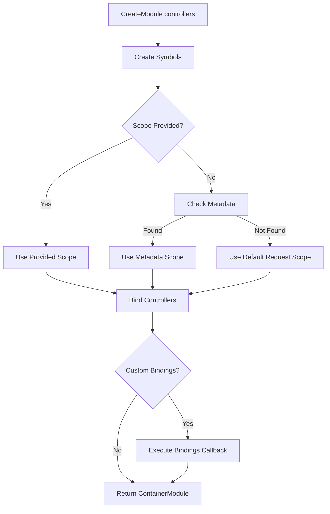

# Container Module - Architecture

> 🎯 **Audience**: Framework developers and contributors

This document explains the internal architecture of the container module system.

---

## Overview

The container module system provides a simplified API for creating InversifyJS ContainerModules, making it easier to:

- Register controllers with automatic symbol generation
- Compose multiple modules
- Set binding scopes declaratively
- Add custom bindings alongside controllers

---

## Architecture Diagram



---

## Core Components

### 1. CreateModule

**Location**: `container-module.ts:227`

**Responsibilities**:
- Create ContainerModule from controllers
- Handle scope resolution (parameter vs metadata)
- Execute custom bindings callbacks

**Key Design**:
- Flexible parameter handling
- Symbol-based controller identification
- Metadata-aware scope detection

### 2. combineModules

**Location**: `container-module.ts:55`

**Responsibilities**:
- Combine multiple modules into one
- Sequential module loading

**Key Design**:
- Creates wrapper ContainerModule
- Calls each module's registry in order

### 3. createModule

**Location**: `container-module.ts:100`

**Responsibilities**:
- Create module from simple callback
- Support both simple and extended callbacks

**Key Design**:
- Wraps callback in ContainerModule
- Supports `(bind)` and `(bind, unbind, isBound, rebind)` signatures

### 4. scope Decorator

**Location**: `container-module.ts:119`

**Responsibilities**:
- Set binding scope via metadata
- Apply appropriate `@provide()` decorator

**Key Design**:
- Stores scope in metadata
- Applies decorator based on scope type

---

## Symbol Generation

Controllers are identified using symbols:

```typescript
const symbol = Symbol.for(controller.name);
```

**Benefits**:
- Unique identification
- No string collisions
- Works with minification

---

## Scope Resolution

Scope is determined in this order:

1. **Explicit parameter** (if provided)
2. **Metadata** (from `@scope()` decorator)
3. **Default** (Request scope)

```typescript
// 1. Explicit
CreateModule([Controller], Scope.Singleton);

// 2. Metadata
@scope(Scope.Singleton)
class Controller { }
CreateModule([Controller]);

// 3. Default
CreateModule([Controller]); // Request scope
```

---

## Module Composition

Modules can be combined:

```typescript
const module1 = CreateModule([Controller1]);
const module2 = createModule((bind) => { /* ... */ });
const combined = combineModules(module1, module2);
```

**Implementation**:
- Creates wrapper ContainerModule
- Calls each module's registry sequentially
- All bindings are registered in order

---

## Extension Points

### Custom Scopes

```typescript
createModule((bind) => {
  bind<IService>("IService").to(Service).inScope("custom-scope");
});
```

### Extended Callbacks

```typescript
createModule((bind, unbind, isBound, rebind) => {
  if (isBound("IService")) {
    rebind<IService>("IService").to(NewService);
  }
});
```

---

## Related Code

- **BaseModule**: `container-module.ts`
- **InversifyJS ContainerModule**: `../di/inversify`

---

## See Also

- [Public API](./container-module-public-api.md) - User-facing documentation

